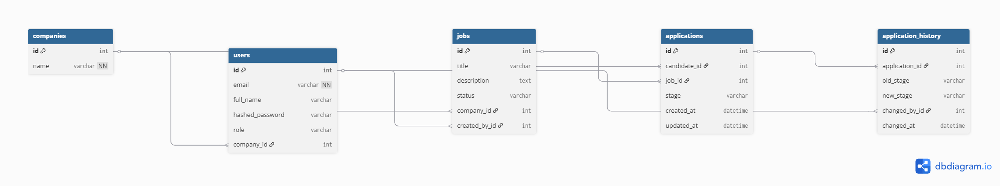

FlowTrack ATS – Applicant Tracking System Backend (FastAPI)

Backend project built by Akhila Priya Nookarapu as a modern Applicant Tracking System (ATS) providing:

🧑‍💼 User roles: Candidate, Recruiter, Hiring Manager

📝 Job posting system

📩 Candidates can apply to jobs

🔁 Application workflow stages

🕒 Complete application history tracking

🔐 JWT Authentication

🔒 Role-Based Access Control (RBAC)

🗂️ SQLite + SQLAlchemy ORM backend

🚀 Live Features Implemented
| Feature                           | Candidate | Recruiter | Hiring Manager |
| --------------------------------- | --------- | --------- | -------------- |
| Register & Login                  | ✅         | ✅         | ✅              |
| Create Job                        | ❌         | ✅         | ✅              |
| Apply to Job                      | ✅         | ❌         | ❌              |
| See Applications for Job          | ❌         | ✅         | ❌              |
| Update Application Stage          | ❌         | ✅         | ❌              |
| View Candidate’s Own Applications | ✅         | ❌         | ❌              |
| View Application History          | ❌         | ✅         | ❌              |

🧱 Architecture Overview
Project Structure
app/
 ├── main.py
 ├── auth.py
 ├── deps.py
 ├── database.py
 ├── models.py
 ├── schemas.py
 ├── routers/
 │    ├── auth_router.py
 │    ├── jobs_router.py
 │    ├── applications_router.py
 │    ├── application_history_router.py
 └── services/
      ├── application_service.py
      ├── state_machine.py
      ├── email_service.py

Tech Used

FastAPI

SQLite

SQLAlchemy ORM

JWT (python-jose)

Passlib (bcrypt hashing)

Uvicorn

🔐 Authentication

Login returns a JWT access token

Protected routes require:

Authorization: Bearer <token>

🔁 Application Workflow

Each job application passes through these states:

Applied → Screening → Interview → Offer → Hired
                           ↓
                        Rejected

Every change is stored in ApplicationHistory along with timestamp & changed_by user.

🗄️ Database Schema (ERD)

Add this file to repo as erd.png then reference it:

📚 API Endpoints
Auth
| Method | Endpoint         | Description         |
| ------ | ---------------- | ------------------- |
| POST   | `/auth/register` | Register a new user |
| POST   | `/auth/login`    | Login & get JWT     |

Jobs
| Method | Endpoint         | Role      | Description |
| ------ | ---------------- | --------- | ----------- |
| GET    | `/jobs/`         | All       | List jobs   |
| POST   | `/jobs/`         | Recruiter | Create job  |
| PUT    | `/jobs/{job_id}` | Recruiter | Update job  |
| DELETE | `/jobs/{job_id}` | Recruiter | Delete job  |

Applications
Method	Endpoint	Role	Description
| Method | Endpoint                      | Role      | Description                       |
| ------ | ----------------------------- | --------- | --------------------------------- |
| POST   | `/applications/?job_id=`      | Candidate | Apply for job                     |
| PATCH  | `/applications/{id}/stage`    | Recruiter | Update stage                      |
| GET    | `/applications/me`            | Candidate | View my applications              |
| GET    | `/applications/job/{job_id}`  | Recruiter | View all applications for a job   |
| GET    | `/applications/recruiter/all` | Recruiter | View all applications system-wide |

History
| Method | Endpoint                    | Role      | Description             |
| ------ | --------------------------- | --------- | ----------------------- |
| GET    | `/history/application/{id}` | Recruiter | Application history     |
| GET    | `/history/me/{id}`          | Candidate | Candidate’s own history |

⚙️ Setup Instructions
1️⃣ Clone Repository
git clone https://github.com/Akhila-priya-Nookarapu/ATS-Backend
cd ATS-Backend

2️⃣ Create Virtual Environment
python -m venv venv

3️⃣ Activate Environment (Windows)
venv\Scripts\activate

4️⃣ Install Dependencies
pip install -r requirements.txt

5️⃣ Run FastAPI Server
uvicorn app.main:app --reload

6️⃣ Open API Docs
http://127.0.0.1:8000/docs

🧪 Postman / Thunder Client Collection

Download and import this:

➡️ ATS-Backend-API.json

🎥 Demo Video Instructions

Record a 3–5 minute video showing:

Register candidate & recruiter

Login and copy JWT tokens

Recruiter → Create job

Candidate → Apply for job

Recruiter → Move stages (Screening → Interview → Offer)

Show application history updates

Show ERD + README

Tools you can use:

OBS Studio

Loom

Windows Xbox Recorder (Win + Alt + R)
